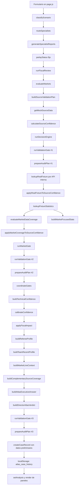
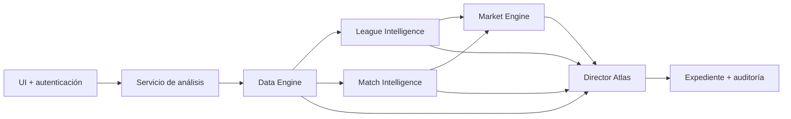

# Atlas Core — Informe de auditoría técnica y funcional

**Fecha de auditoría:** 2026-08-01

**Repositorio:** `/Users/yezidquitian/Documents/atlas-core`

**Rama y revisión auditadas:** `main` en `b2e74e0`

**Alcance:** inspección y diagnóstico. No se modificó la aplicación, no se borraron archivos, no se hizo commit y no se desplegó nada.

## Resumen ejecutivo

Atlas Core no necesita reconstruirse desde cero. La base contiene piezas rescatables: una aplicación Next.js que compila, adaptadores de API-FOOTBALL, normalizadores, resolución de competición, perfiles preliminares, reglas de cobertura, controles prudentes, un expediente local y una salida denominada DirectorAtlas.

El problema principal no es la ausencia de módulos, sino su acumulación sin un contrato central. `src/app/page.js` tiene 2.674 líneas y actúa al mismo tiempo como formulario, orquestador, cliente de datos, motor de análisis, memoria, controlador de acordeones y vista. Treinta y uno de los 36 commits tocaron ese archivo y 27 tocaron `globals.css`, señal clara de crecimiento aditivo. Los motores producen varios conceptos incompatibles de “confianza”, tres niveles de gates, dos voces finales y estados de línea/cuota que no se retroalimentan.

La conclusión de esta auditoría es:

- **La base es recuperable.** Deben conservarse los normalizadores, catálogos, conectores reales, taxonomías y la intención prudente de los gates.
- **La aplicación compila en producción.** El build solo requiere acceso a Google Fonts en su estado actual.
- **El lint falla con un error real** en la carga de historial desde `localStorage`.
- **No hay pruebas automatizadas.** Existe un catálogo de cuatro casos, pero no un runner ni aserciones.
- **Atlas no está listo para uso privado en Internet.** No hay autenticación y las siete rutas API quedan públicas, por lo que cualquiera podría consumir la cuota del proveedor.
- **La probabilidad estimada no es estadísticamente válida.** Parte de 50% y suma constantes por cobertura; puede mostrar 50% con respaldo técnico 0. Debe ser `no disponible` hasta existir un modelo verificable por mercado.
- **El camino positivo es inalcanzable en el flujo actual.** La confianza de fuente queda limitada a 68%, `ValidationGate` exige 70% y `MarketGate` nunca autoriza recomendación aun con línea/cuota. Esto no debe “arreglarse para recomendar más”, sino reemplazarse por una política coherente y demostrable.
- **DirectorAtlas todavía no es la única voz.** `atlasExecutiveAnswer`, `decisionEngine`, `gateCoordinator` y DirectorAtlas publican conclusiones operativas distintas.
- **Supabase encaja como autenticación y persistencia**, con registro público desactivado, invitaciones, sesiones SSR por cookies y RLS por propietario/rol.
- **Vercel es un destino compatible**, pero solo después de proteger página y rutas, resolver vulnerabilidades de dependencias, crear pruebas y eliminar la dependencia obligatoria de fuentes remotas durante el build.

---

## A. Estado actual de compilación

### Entorno observado

| Elemento | Resultado |
|---|---|
| Node.js | `v24.16.0` |
| npm | `11.13.0` |
| Next.js instalado | `16.2.9` |
| React / React DOM | `19.2.4` |
| Dependencias instaladas | Sí; `node_modules` y `package-lock.json` ya existían |
| Instalación ejecutada | No fue necesaria |
| Estado Git inicial | Rama `main`; cuatro elementos no rastreados previos |

### `npm run lint`

**Resultado:** falló, código de salida 1.

Error único:

- `src/app/page.js:118`: `react-hooks/set-state-in-effect`. El efecto de montaje lee `localStorage` y llama sincrónicamente a `setCaseHistory`, lo que puede producir renders encadenados. No es un falso positivo del entorno.

No hubo advertencias adicionales de ESLint.

### `npm run build`

Primer intento:

- Falló porque el entorno restringido no pudo descargar `Geist` y `Geist Mono` desde Google Fonts mediante `next/font/google`.
- Esto no era un error de sintaxis o de tipos.

Segundo intento, con acceso de red únicamente para verificar la compilación:

- **Correcto, código de salida 0.**
- Compilación Turbopack correcta.
- TypeScript/check de Next terminado correctamente.
- 11 páginas/rutas generadas.
- Ruta `/` estática.
- Siete rutas API dinámicas:
  - `/api/football/find-fixture`
  - `/api/football/fixture-statistics`
  - `/api/football/fixtures`
  - `/api/football/fixtures-by-league`
  - `/api/football/leagues`
  - `/api/football/search-leagues`
  - `/api/football/status`

**Riesgo de build:** la producción depende de una descarga de Google Fonts. Para builds reproducibles y privados conviene autoalojar las fuentes o usar una pila de fuentes del sistema.

### Pruebas

`package.json` no define `test` y no existen archivos ejecutables `*.test.*` o `*.spec.*`. `src/core/testing/atlasTrialCases.js` es solo un arreglo de datos con cuatro escenarios y expectativas en lenguaje natural; no ejecuta módulos ni contiene aserciones.

Por esa razón no se ejecutó `npm test`: el script no existe. Los cuatro casos se deben convertir en pruebas de contrato antes de refactorizar.

### Dependencias y avisos de seguridad

`npm audit --omit=dev` terminó con código 1 y reportó **tres paquetes con severidad alta**:

- `next@16.2.9`: varios avisos de seguridad acumulados por el rango instalado.
- `postcss@8.4.31`: avisos de XSS/divulgación relacionados con serialización y source maps.
- `sharp@0.34.5`: avisos heredados de libvips; npm indica que existe corrección para este componente.

La versión más reciente de Next consultada durante la auditoría fue `16.2.12`; no se actualizó nada. Antes de desplegar se debe probar una actualización controlada y repetir lint, build, pruebas y audit. No se debe ejecutar `npm audit fix` a ciegas.

---

## B. Mapa completo del flujo actual

### Flujo real desde el formulario



### Observaciones del flujo

1. El formulario no llama a un servicio de aplicación; ejecuta toda la tubería dentro de un Client Component.
2. `parlayStatus` se fija como “Esperar validación” cuando el uso es parlay y nunca se recalcula.
3. `fiscalReview`, `decisionResult` y `marketEvaluation` se calculan antes de consultar datos reales y no se reconstruyen después.
4. `ValidationGate` y `AuditPrep` se ejecutan tres veces con resultados equivalentes o parcialmente actualizados.
5. Línea y cuota se procesan **después** de `MarketGate`, `GateCoordinator`, confianza técnica y calibración. Por diseño, no pueden habilitar ni modificar esos motores.
6. `atlasExecutiveAnswer` se construye antes de DirectorAtlas y no recibe línea/cuota, perfiles, impacto fiscal final ni cobertura complementaria.
7. El expediente se crea al final, pero contiene la decisión preliminar y no guarda fixture, estadísticas, línea, cuota, cobertura, gates finales, calibración ni dictamen del Director.
8. El historial se guarda en el navegador, limitado a diez elementos y editable por el usuario.

### Dependencia efectiva

Con excepción de `scenarioClassifier → competitionResolver` y de los normalizadores usados por Route Handlers, los módulos no forman una arquitectura por capas: `page.js` importa 30 módulos y los conecta manualmente. El acoplamiento real es, por tanto, **todos contra la página**.

---

## C. Inventario de módulos

Hay **34 archivos** en `src/core/modules`.

| Módulo / export principal | Función actual | Entradas principales | Salidas principales | Consumidores actuales | Clasificación y destino |
|---|---|---|---|---|---|
| `atlasExecutiveAnswer` / `buildAtlasExecutiveAnswer` | Resume gates, hechos y advertencias | coordinador, gate de mercado, cobertura, fixture, estadísticas, fuentes, input | segunda respuesta ejecutiva | `page.js` | Interfaz/voz duplicada; fusionar en DirectorAtlas |
| `auditPrep` / `prepareAuditPlan` | Prepara checklist postpartido | input, escenario, mercado, fiscal, decisión, fuente | preguntas, controles, prioridad de auditoría | `page.js` | Auxiliar de auditoría; mantener como subsistema no operativo |
| `caseRecorder` / `createCaseRecord` | Construye expediente preliminar | input, escenario, especialistas, fiscal, decisión, parlay | objeto de caso con ID y faltantes | `page.js`, historial local | Esencial, pero reescribir para guardar el run completo |
| `competitionResolver` / `resolveCompetition` | Infiere competición/división por alias y equipos | partido, competición | competición resuelta, score, advertencias | `scenarioClassifier` | Esencial de League Intelligence; mantener y ampliar |
| `complementarySourceCoverage` / `buildComplementarySourceCoverage` | Evalúa fuente adicional requerida por mercado | mercado, estadísticas, cobertura, perfiles, línea | estado, faltantes, bloqueo | `page.js`, DirectorAtlas | Esencial de calidad/mercado; corregir contrato y fusionar reglas |
| `confidenceCalibration` / `calibrateConfidence` | Aplica techos y genera probabilidad/nivel operativo | confianza técnica, fuente, gates, fixture, estadísticas | soporte, probabilidad, caps, nivel | `page.js`, `fiscalImpact`, DirectorAtlas | Esencial solo como calibración de calidad; reescribir probabilidad |
| `decisionEngine` / `runDecisionEngine` | Emite decisión preliminar basada en fiscal y competición | input, escenario, especialistas, fiscal, parlay | decisión, confianza, riesgo, acción | `page.js`, expediente, auditoría | Responsabilidad solapada; fusionar/deprecar frente a Director |
| `directorAtlas` / `buildDirectorAtlasVerdict` | Integra resultados y redacta dictamen | gates, cobertura, datos, perfiles, línea, fiscal, calibración | veredicto, razones, riesgos, faltantes, permisos | `page.js` | Esencial y única voz objetivo; mantener contrato, reescribir lógica |
| `fiscalEngine` / `runFiscalReview` | Detecta objeciones a partir de faltantes iniciales | input, escenario, especialistas, parlay | severidad, objeciones, warnings | `page.js`, mercado, decisión, auditoría, impacto fiscal | Esencial de riesgo; fusionar con política fiscal final |
| `fiscalImpact` / `applyFiscalImpact` | Resta puntos y agrega bloqueos | fiscal, calibración, coordinador, uso | scores ajustados, bloques | `page.js`, DirectorAtlas | Duplicado del Fiscal; fusionar y separar riesgo de probabilidad |
| `fixtureMatcher` / `matchFixturesByTeams` | Filtra fixtures por nombres de equipos | fixtures normalizados, home/away/team | lista coincidente | ruta `find-fixture` | Esencial de Data Engine; endurecer matching y fecha |
| `footballFixtureNormalizer` | Normaliza respuesta de fixtures | items crudos API-FOOTBALL | fixture(s) con contrato Atlas | rutas `fixtures` y `find-fixture` | Esencial de Data Engine; mantener con schemas |
| `footballStatisticsNormalizer` | Normaliza estadísticas por equipo | items crudos API-FOOTBALL | estadísticas, claves disponibles, quality flags | ruta `fixture-statistics` | Esencial de Data Engine; mantener con versionado |
| `gateCoordinator` / `coordinateGates` | Intenta resolver jerarquía entre gates | validation gate, market gate, fuente, uso | permiso final | `page.js`, confianza, calibración, respuestas | Esencial como concepto, pero reescribir como única Policy Engine |
| `marketCoverageImpact` | Suma cobertura al score de fuente | fuente, cobertura de mercado | fuente mutada + impacto | `page.js`, UI técnica | Responsabilidad solapada; fusionar con Data Quality |
| `marketDataCoverage` | Mapea mercados a estadísticas requeridas | texto de mercado, estadísticas | covered/partial/missing, faltantes | `page.js`, gate, confianza, Director | Esencial de Market Engine; mantener una sola taxonomía |
| `marketEvaluator` | Elige familia y alternativas genéricas | mercado, escenario, informes, fiscal | candidatos, estado y “confianza” 10–25% | `page.js`, source validation | Incompleto/heurístico; conservar taxonomía, eliminar falsa evaluación |
| `marketFocusedStats` | Extrae estadísticas relevantes por mercado | mercado, estadísticas | filas por equipo, disponibles/faltantes | `page.js`, confianza, perfil reciente | Esencial de presentación/mercado; fusionar reglas duplicadas |
| `marketGate` / `runMarketGate` | Bloquea por cobertura estadística | cobertura, stats, fuente, input | permiso del mercado | `page.js`, coordinador, confianza, Director | Esencial como regla, fusionar con coordinador |
| `marketLineContext` | Parsea línea/cuota y clasifica contexto | mercado, línea, cuota, calibración, perfiles | números, estado, flags, bloqueo | `page.js`, cobertura complementaria, Director | Esencial; reescribir con validación semántica y valor real |
| `projectStatus` / `getProjectStatus` | Devuelve una lista estática de estado v0.1 | ninguna | módulos, fase, próximos módulos | `page.js` | Interfaz interna desactualizada; retirar de producción |
| `realFixtureLookup` | Convierte texto a query y busca fixture | partido, competición, temporada | fixture seleccionado y metadatos | `page.js`, perfiles, stats | Esencial de Data Engine; mover a servidor y corregir temporada/fecha |
| `realFixtureSourceImpact` | Suma puntos por fixture confirmado | fuente, fixture, familia | fuente mutada, score y críticos resueltos | `page.js`, UI | Solapado con Data Quality; fusionar |
| `realFixtureStatisticsLookup` | Consulta estadísticas del fixture | resultado de fixture | wrapper con estadísticas normalizadas | `page.js` | Esencial de Data Engine; mantener y tipar |
| `refereeProfile` | Identifica árbitro y declara históricos faltantes | fixture, mercado, fuente | perfil, sensibilidad, límites sugeridos | `page.js`, línea, cobertura, Director | Match Intelligence incompleto; mantener interfaz, implementar datos reales |
| `scenarioClassifier` | Etiqueta escenario, clásico y candidatos | modo, partido, competición, mercado | tags, mercados, especialistas, competición | `page.js`, router | Auxiliar esencial; simplificar y evitar hechos no verificados |
| `sourceConfidenceEngine` | Puntúa fuentes mock/pendientes | conector, plan de validación | calidad, score, bloqueos | `page.js`, impactos y gates | Esencial como Data Quality, pero reescribir con evidencia/provenance |
| `sourceConnectorMock` | Simula seis fuentes pendientes | escenario, input | datos mock y resumen | `page.js` | Mock; retirar del flujo de producción, conservar solo en tests |
| `sourceValidation` | Construye requisitos de fuente | escenario, informes, mercado, input | fuentes requeridas y críticos | `page.js`, confianza | Esencial de Data Quality; fusionar reglas con cobertura |
| `specialistEngine` | Genera informes textuales plantillados | ruta, escenario, mercado, uso | informes, faltantes, riesgos | `page.js`, fiscal, mercado | Incompleto; convertir en explicadores de Match/League Intelligence |
| `specialistRouter` | Activa especialistas por palabras clave | escenario, mercado, uso | lista y prioridades | `page.js`, specialist engine | Auxiliar; puede fusionarse con perfiles/reglas de dominio |
| `teamRecentProfile` | Declara necesidad de forma reciente | fixture, estadísticas, stats enfocados, mercado | equipos, faltantes, límites | `page.js`, línea, cobertura, Director | Match Intelligence incompleto; mantener interfaz, corregir shape y obtener histórico |
| `technicalConfidence` | Suma puntos por presencia de datos | fuente, gates, cobertura, fixture, stats | score técnico, nivel, exposición | `page.js`, calibración | Solapado; fusionar con calibración y renombrar a completeness/support |
| `validationGate` / `runValidationGate` | Autoriza según críticos, fiscal y score | decisión, fiscal, fuente, mercado, input | estado, permiso, parlay | `page.js`, coordinador | Esencial como regla, pero contrato incompatible; fusionar |

### Clasificación transversal

**Esenciales:** normalizadores, matching, lookups reales, resolver de competición, cobertura de mercado, contexto de línea, perfiles de árbitro/equipos, expediente, política de decisión y DirectorAtlas.

**Auxiliares:** `scenarioClassifier`, router/explicadores de especialistas, extracción enfocada, auditoría.

**Interfaz:** la mayor parte de `page.js`, `atlasExecutiveAnswer`, `projectStatus`, render de expedientes y paneles.

**Mocks/simulados:** `sourceConnectorMock`; informes de `specialistEngine` y candidatos de `marketEvaluator` son plantillas heurísticas, no evidencia deportiva.

**Incompletos:** `refereeProfile`, `teamRecentProfile`, `marketLineContext`, `confidenceCalibration`, `marketEvaluator`, `projectStatus` y `atlasTrialCases` como pruebas.

---

## D. Dependencias entre módulos

### Dependencias de código directas

- `scenarioClassifier` importa `competitionResolver`.
- `competitionResolver` importa `src/core/data/competitions.js`.
- `find-fixture/route.js` importa `apiFootballLeagues`, `footballFixtureNormalizer` y `fixtureMatcher`.
- `fixtures/route.js` importa `apiFootballLeagues` y `footballFixtureNormalizer`.
- `fixture-statistics/route.js` importa `footballStatisticsNormalizer`.
- Los restantes módulos no importan otros motores; `page.js` los orquesta.

### Grafo funcional recomendado a partir de lo existente



La dependencia debe ser unidireccional. Ninguna capa debe mutar objetos de otra capa; cada una debe devolver un resultado versionado e inmutable con `status`, `data`, `quality`, `provenance`, `missing` y `warnings`.

---

## E. Duplicaciones y contradicciones

### 1. `decisionEngine` vs `validationGate` vs `marketGate` vs `gateCoordinator`

- `decisionEngine` decide antes de obtener fixture, estadísticas, línea y cuota.
- `validationGate` usa strings con emoji como `gateStatus`; `gateCoordinator` espera el literal interno `blocked`. Una ejecución aislada confirmó que `🔴 No decidir todavía` termina como `exploratory` y `canAnalyze: true`.
- `marketGate` solo considera cobertura. Incluso con cobertura completa devuelve `preliminary`, `canRecommend: false` y dice que faltan línea/cuota.
- `gateCoordinator` da prioridad absoluta a ese `preliminary` y nunca recibe `marketLineContext`; por ello una línea/cuota real no puede cambiar el permiso.
- `sourceConfidence` queda limitado a 68 en el mejor camino actual, mientras `validationGate` exige 70 para recomendar.
- Resultado: hay varios semáforos, pero no una máquina de estados coherente ni un camino verificable de transición.

**Decisión:** fusionar los tres gates y la autorización final de `decisionEngine` en una única Policy Engine con enums estables, precedencia explícita y pruebas de tabla.

### 2. `fiscalEngine` vs `fiscalImpact`

- El primero genera objeciones desde informes plantillados y un `parlayStatus` fijo.
- El segundo vuelve a interpretar el texto de la severidad, resta puntos de soporte y también resta probabilidad del evento.
- `blocksParlay` incluye `useCase === "parlay"`; una ejecución aislada confirmó que incluso sin objeciones, con gate habilitado y soporte alto, solicitar parlay lo bloquea por definición.
- Riesgo operativo y probabilidad del evento son conceptos distintos: una objeción debería bloquear o limitar la acción, no cambiar artificialmente la probabilidad deportiva.

**Decisión:** un solo Fiscal/Risk Policy. Debe producir `severity`, `blocking_reasons`, `operational_caps` y `audit_notes`, sin alterar la probabilidad del evento.

### 3. `technicalConfidence` vs `confidenceCalibration`

- `technicalConfidence` puntúa presencia de datos, no probabilidad de acierto. El nombre “fuerza técnica” puede interpretarse como respaldo del mercado.
- `confidenceCalibration` parte de 50% y suma 5/4/4 por cobertura y umbrales de soporte. No usa distribución histórica, línea, localía, rival, forma, árbitro ni modelo por mercado.
- Una ejecución aislada con soporte 0, sin fixture y sin estadísticas devolvió **probabilidad estimada 50%**.
- Coexisten al menos cuatro porcentajes: confianza preliminar 10–25%, calidad informativa, soporte técnico y probabilidad estimada.

**Decisión:** mantener por separado:

1. `data_quality_score`: completitud, actualidad, concordancia y provenance.
2. `technical_support_score`: cobertura de variables requeridas.
3. `estimated_probability`: nullable; solo existe si un modelo de mercado validado la produce.
4. `operational_level`: consecuencia de políticas, no sinónimo de probabilidad.

### 4. `atlasExecutiveAnswer` vs `directorAtlas`

Ambos se muestran en vista simple. `atlasExecutiveAnswer` no conoce línea/cuota, impacto fiscal final, perfiles ni cobertura complementaria; DirectorAtlas sí. Esto permite dos mensajes finales distintos.

**Decisión:** eliminar la salida pública de `atlasExecutiveAnswer` y absorber cualquier campo útil en el contrato de DirectorAtlas. Los demás módulos deben ser evidencia auditable, nunca voces paralelas.

### 5. Línea/cuota ingresada vs faltantes reportados

- `marketDataCoverage.missingExternalData` siempre incluye “Línea de mercado” y “Cuota”.
- DirectorAtlas filtra esos dos textos de algunas listas cuando `marketLineContext` los detecta, pero no filtra `marketGate.requiredAction` ni `gateCoordinator.requiredAction`.
- Una ejecución aislada con línea `Más de 4.5` y cuota `1.85` produjo correctamente “Cuota informada: 1.85”, pero mantuvo como condición “Agregar línea de mercado, cuota...”.
- El campo llamado internamente `minimumAcceptableOdds` contiene la cuota ingresada, no una cuota mínima calculada.
- No se calcula probabilidad implícita (`1/cuota`), margen de la casa ni diferencia contra una probabilidad modelada.

**Decisión:** línea y cuota deben formar parte del `AnalysisRequest` desde el inicio y del `MarketAssessment`. La fuente de mercado debe indicar `reported_by_user` o `verified_provider`; una entrada del usuario no equivale a cuota verificada.

### 6. Estadísticas obtenidas vs módulos que dicen que faltan

`lookupFixtureStatistics` devuelve `realFixtureStatistics.statistics.availableStats`. Sin embargo:

- `teamRecentProfile` consulta `realFixtureStatistics.availableStats`.
- `complementarySourceCoverage` consulta `realFixtureStatistics.availableStats`.

Una ejecución aislada con estadísticas presentes confirmó que ambos ven una lista vacía. Además, `marketFocusedStats` devuelve `row.team`, pero `teamRecentProfile.extractTeamStats` busca `row.teamName` o `row.name`, por lo que registra “Equipo no identificado”.

**Decisión:** definir y validar un único schema `FixtureStatisticsResult` y prohibir accesos opcionales a múltiples shapes.

### 7. Datos faltantes vs respaldo técnico

- El mock continúa diciendo “No conectado” aun después de encontrar fixture y estadísticas reales.
- Los impactos solo ajustan un score y no actualizan el inventario de evidencias.
- `realFixtureSourceImpact` puede sumar por marcador de un partido terminado, aunque el usuario pretendiera analizar uno futuro.
- `refereeProfile` limita confianza si hay árbitro identificado sin histórico, pero si no existe árbitro puede devolver `shouldLimitConfidence: false`; DirectorAtlas puede omitir la limitación específica.

**Decisión:** cada requisito de dato debe tener un registro único con estado `missing | user_reported | fetched | verified | contradicted | stale`, no listas de strings desconectadas.

### 8. Selección del fixture

- La ruta principal usa `developmentSeason` antes que `currentSeason`; el catálogo fija 2024 como development y 2026 como actual. Un análisis sin temporada consulta 2024.
- `selectBestFixture` prioriza un partido terminado con árbitro sobre uno próximo.
- No existe fecha en el formulario ni matching por fecha/jornada.
- La búsqueda fija `countryKey: Colombia` y cae por defecto en Primera A.
- `inferApiLeagueKey` lee `resolvedCompetition.name`, aunque el resolver devuelve `competitionName`.
- El matching por substring solo acepta orientación local/visitante exacta y puede generar falsos positivos con nombres cortos.

**Impacto:** Atlas puede analizar un encuentro histórico distinto del pretendido y presentarlo como “fixture real confirmado”. Este es un bloqueo P0 para uso real.

### 9. Parlay

- Estado inicial fijo “Esperar validación”.
- El Fiscal objeta porque el estado no es “Apto”.
- `ValidationGate` exige un verde inalcanzable con el cap actual.
- `MarketGate` nunca autoriza parlay.
- `fiscalImpact` bloquea por el solo hecho de que el usuario eligió parlay.
- DirectorAtlas puede mostrar múltiples razones redundantes, pero no una evaluación de correlación, horario, madurez ni composición del parlay.

**Decisión:** no habilitar parlay hasta tener una política explícita. Mientras tanto el contrato debe decir `unsupported`, no simular una evaluación.

### 10. CSS y UI duplicados

- `globals.css` tiene 3.783 líneas.
- Las reglas de acordeón global están repetidas tres veces.
- `.view-mode-panel` y múltiples grids/headers aparecen repetidos con `!important` acumulados.
- Existen selectores antiguos que no coinciden con las clases reales (`source-validation-panel` vs `source-panel`, entre otros).
- `page.module.css` no está importado.

---

## F. Riesgos técnicos y de seguridad

### Riesgos P0 — bloquean una aplicación privada

1. **Sin autenticación:** la página y las rutas API son públicas.
2. **Consumo abierto de la clave del proveedor:** la clave no llega al navegador, pero cualquier visitante puede invocar las rutas del servidor y gastar cuota.
3. **Fixture posiblemente incorrecto:** temporada 2024 por defecto y preferencia por encuentros finalizados.
4. **Probabilidad inventada por heurística:** 50% base sin modelo deportivo.
5. **Dependencias con avisos high:** deben actualizarse y reauditarse antes de exposición.

### Riesgos P1

- No hay rate limiting, límites de longitud, schema validation ni validación numérica robusta de query params.
- No hay timeout ni cancelación para fetch externos; una API lenta puede retener funciones.
- Rutas devuelven `rawErrors`; `/status` reenvía el objeto completo del proveedor, potencialmente con metadatos de cuenta/cuota.
- No existe caché controlada; cada análisis puede descargar una temporada completa de fixtures y gastar latencia/cuota.
- Errores `error.message` se envían al cliente.
- No hay protección contra doble clic/carreras; el formulario no muestra loading ni aborta solicitudes previas.
- El formulario permite valores vacíos y llama a fuentes usando placeholders.
- `localStorage` no tiene aislamiento por usuario, integridad ni confidencialidad; cualquier script en el origen puede leer/modificar expedientes.
- El ID de caso usa resolución de segundos y puede colisionar.
- No se guarda versión del motor, fuente, timestamps de evidencia ni snapshot reproducible.
- `page.js` es un Client Component: toda regla de negocio importada termina en el bundle del navegador. Aunque no contiene claves, expone reglas, umbrales y taxonomías.

### Variables de entorno y API keys

Hallazgos positivos:

- `.env*` está ignorado por Git.
- `.env.local` no está rastreado y no aparece como archivo versionado en el historial alcanzable revisado.
- La clave y el base URL están configurados localmente; sus valores no se imprimieron en este informe.
- No existen variables secretas con prefijo `NEXT_PUBLIC_`.
- `API_FOOTBALL_KEY` se lee únicamente en Route Handlers de servidor mediante `process.env`.

Riesgos y acciones:

- `.env.local` tiene permisos `-rw-r--r--`; en un equipo multiusuario conviene permisos más restrictivos.
- Falta `.env.example` con nombres no secretos y documentación.
- `API_FOOTBALL_BASE_URL` también debe validarse contra un allowlist de host, aunque hoy no lo controla el usuario.
- En producción, las claves deben residir en Environment Variables de Vercel, separadas por Preview/Production. Vercel documenta que estas variables se gestionan fuera del código y se aplican a nuevos despliegues: [Vercel Environment Variables](https://vercel.com/docs/environment-variables).
- Nunca usar `NEXT_PUBLIC_API_FOOTBALL_KEY` ni exponer una Supabase secret/service-role key al navegador. Las variables `NEXT_PUBLIC_*` quedan incorporadas al bundle del cliente: [Vercel — Environment and Security](https://vercel.com/academy/nextjs-foundations/env-and-security).

### Riesgos de producto y explicabilidad

- Los textos de especialistas son plantillas, pero la UI usa términos como “evidencia”. Deben etiquetarse como requisitos/hipótesis.
- `marketEvaluator` propone mercados alternativos sin datos; puede parecer recomendación implícita.
- Datos de un único fixture terminado no equivalen a forma reciente.
- “API-FOOTBALL verified: true” solo confirma procedencia técnica, no calidad, actualidad ni concordancia.
- La interfaz muestra muchos porcentajes sin definiciones cerca del resultado final.

---

## G. Archivos que se deben mantener

Mantener no significa dejarlos sin cambios; significa preservar su capacidad y su historia.

- `package.json`, `package-lock.json`, configuración Next/ESLint/jsconfig y `.gitignore`.
- `src/core/data/competitions.js` y `apiFootballLeagues.js`, con versionado y actualización de temporadas.
- `competitionResolver.js` y `scenarioClassifier.js`.
- `footballFixtureNormalizer.js`, `footballStatisticsNormalizer.js`, `fixtureMatcher.js`.
- `realFixtureLookup.js` y `realFixtureStatisticsLookup.js`, moviendo ejecución al servidor.
- `marketDataCoverage.js` y el concepto de `marketFocusedStats.js`.
- `refereeProfile.js`, `teamRecentProfile.js` y `marketLineContext.js` como contratos de capacidades futuras.
- `caseRecorder.js` y `auditPrep.js`, reorientados a persistencia completa y auditoría.
- `directorAtlas.js` como única voz final.
- `atlasTrialCases.js`, convertido en pruebas ejecutables de regresión.
- Route Handlers necesarios de API-FOOTBALL, consolidados y protegidos.
- Git completo: 36 commits actuales y todos los cambios del usuario.

---

## H. Archivos que se deben fusionar

| Grupo | Fusión propuesta | Motivo |
|---|---|---|
| `validationGate` + `marketGate` + `gateCoordinator` + autorización de `decisionEngine` | `market-engine/policyEngine` | Una sola máquina de estados y precedencia |
| `fiscalEngine` + `fiscalImpact` | `market-engine/riskPolicy` | Una sola severidad; no restar probabilidad |
| `technicalConfidence` + parte válida de `confidenceCalibration` | `market-engine/supportCalibration` | Un score de soporte/completitud con caps transparentes |
| `atlasExecutiveAnswer` + `directorAtlas` | `director-atlas/buildVerdict` | Una única voz pública |
| `marketDataCoverage` + reglas de `marketFocusedStats` + reglas de `complementarySourceCoverage` | Registro único de requisitos por mercado | Evitar tres taxonomías casi iguales |
| `sourceValidation` + `sourceConfidenceEngine` + impactos de fixture/coverage | `data-engine/dataQuality` | Estado único por evidencia y requisito |
| `specialistRouter` + `specialistEngine` | Explicadores dentro de League/Match Intelligence | Reducir personajes que no poseen datos propios |
| `fixtures` + `fixtures-by-league` | Una ruta/servicio interno de fixtures | Evitar normalizaciones y contratos distintos |
| `leagues` + `search-leagues` | Un servicio de catálogo/búsqueda | Evitar respuestas raw y rutas duplicadas |

Fusionar responsabilidades no obliga a crear archivos monolíticos; el objetivo es un contrato y dueño único por decisión.

---

## I. Archivos que se deben reescribir

1. **`src/app/page.js`:** dividir UI, estado y orquestación. La página debe llamar a un servicio de servidor y renderizar un único `AnalysisResult`.
2. **`src/app/globals.css`:** consolidar reglas, eliminar bloques duplicados y usar componentes accesibles.
3. **`directorAtlas.js`:** consumir un contrato final ya coherente, sin reparar strings de módulos anteriores.
4. **`confidenceCalibration.js`:** eliminar probabilidad heurística; usar `null` hasta que haya modelo validado.
5. **`teamRecentProfile.js`:** corregir shape y obtener últimos partidos reales separados local/visitante.
6. **`refereeProfile.js`:** representar ausencia de árbitro como limitación cuando el mercado sea sensible y añadir histórico verificable.
7. **`realFixtureLookup.js`:** exigir fecha/temporada o desambiguación; no elegir un partido terminado por tener árbitro.
8. **`marketLineContext.js`:** validar tipo de mercado, selección, dirección, umbral y cuota; distinguir reportado vs verificado.
9. **`caseRecorder.js`:** persistir request, evidencias, outputs de cada capa, versión y dictamen final.
10. **Route Handlers:** autenticación, autorización, schemas, rate limit, timeout, cache y errores sanitizados.
11. **`layout.js`:** metadata Atlas, idioma `es`, fuentes reproducibles y shell autenticado.
12. **`README.md`:** reemplazar texto de Create Next App por arquitectura, variables, comandos, seguridad y límites del producto.

---

## J. Archivos que podrían eliminarse

Solo después de migrar su capacidad y con un commit separado/reversible:

- `src/core/modules/atlasExecutiveAnswer.js`, tras absorber sus campos útiles en DirectorAtlas.
- `src/core/modules/sourceConnectorMock.js` del bundle de producción; puede moverse a fixtures de test.
- `src/core/modules/projectStatus.js` y su panel público; el estado de desarrollo pertenece a documentación/observabilidad interna.
- `src/app/page.module.css`, actualmente no importado.
- SVGs por defecto de Create Next App en `public/`, sin referencias.
- `CLAUDE.md`, que contiene solo 11 bytes y no aporta instrucciones observables.
- Archivos cero bytes no rastreados `atlas-core@0.1.0` y `next`, aparentemente residuos de una orden previa.
- Una de cada pareja de rutas duplicadas después de consolidación: `fixtures`/`fixtures-by-league` y `leagues`/`search-leagues`.

No se recomienda eliminar `atlasTrialCases.js`; debe convertirse en suite ejecutable. Tampoco se recomienda borrar módulos de auditoría: pueden quedar fuera de la decisión operativa y persistir como evidencia.

---

## K. Arquitectura propuesta en cinco capas

### 1. Data Engine

Responsabilidades:

- Clientes de proveedor solo en servidor.
- Fetch con timeout, retry limitado, cache y control de cuota.
- Normalización mediante schemas versionados.
- Provenance: proveedor, endpoint, parámetros, `fetched_at`, `observed_at`, external ID y hash.
- Calidad por campo: actualidad, completitud, concordancia, estado y warnings.
- Repositorios Supabase para snapshots y expedientes.

Rescata: normalizadores, fixture matcher, lookups, catálogo API-FOOTBALL, source validation/confidence.

### 2. League Intelligence

Responsabilidades:

- Perfil por competición y temporada.
- Goles, tarjetas, faltas, remates, córners, ritmo, localía, volatilidad y cobertura.
- Tamaño de muestra y ventana temporal explícitos.
- Ningún promedio se crea si no existe data suficiente.

Rescata: `competitions`, `competitionResolver`, parte de `scenarioClassifier`. Esta capa hoy casi no existe y debe construirse desde datos almacenados, no desde textos plantillados.

### 3. Match Intelligence

Responsabilidades:

- Identidad inequívoca del fixture.
- Forma reciente local/visitante, rival ajustado, alineaciones, lesiones, sanciones, árbitro, contexto, H2H y estado.
- Distinguir prepartido, vivo y postpartido.
- Cada señal incluye fuente, fecha y calidad.

Rescata: `realFixtureLookup`, `refereeProfile`, `teamRecentProfile`, especialistas de contexto/táctica/plantillas.

### 4. Market Engine

Responsabilidades:

- Taxonomía única de mercados.
- Validación semántica de selección, línea y cuota.
- Requisitos de datos por mercado.
- Coverage gate y risk policy en una sola máquina de estados.
- Probabilidad estimada solo cuando exista modelo validado; de lo contrario `unavailable`.
- Comparación con probabilidad implícita y margen solo con cuota verificada.
- Descartar explícitamente mercados sin respaldo.
- Parlay como capacidad separada y inicialmente `unsupported`.

Rescata: market coverage/focused stats/line, gates, Fiscal y calibración.

### 5. Director Atlas

Responsabilidades:

- Única salida para UI y expediente.
- No vuelve a calcular datos; integra resultados ya consistentes.
- Contrato mínimo:
  - `verdict`
  - `market_evaluated`
  - `selection_and_line`
  - `technical_support`
  - `estimated_probability` o `unavailable`
  - `operational_level`
  - `reasons`
  - `risks`
  - `missing_data`
  - `avoid`
  - `parlay_authorization`
  - `next_action`
  - `evidence_refs`
  - `engine_version`

Los módulos internos solo aparecen en vista técnica como trazabilidad del dictamen.

### Organización sugerida

```text
src/
  app/
    (auth)/
    (private)/
    api/
  core/
    contracts/
    data-engine/
    league-intelligence/
    match-intelligence/
    market-engine/
    director-atlas/
  infrastructure/
    supabase/
    providers/
  components/
    analysis/
    technical/
```

La interfaz no cuenta como una sexta capa de decisión; es un adaptador sobre las cinco capas de dominio.

---

## L. Plan de migración por fases

### Fase 0 — Congelar comportamiento y asegurar el rescate

- Etiquetar el baseline actual sin reescribir historial.
- Convertir los cuatro Atlas Trial Cases en pruebas.
- Añadir tests de las contradicciones encontradas y snapshots de DirectorAtlas.
- Definir contratos JSON y enums estables.

### Fase 1 — Extraer la aplicación de `page.js`

- Separar formulario, resultado simple, vista técnica e historial.
- Crear un servicio `runAtlasAnalysis` en servidor.
- Mantener la UI actual mientras cambia la arquitectura interna.
- Rehacer acordeones con `<button>`, `aria-expanded`, foco y estado React.

### Fase 2 — Consolidar Data Engine

- Mover llamadas a proveedor y claves a código `server-only`.
- Validar inputs/outputs y corregir shapes.
- Exigir fecha/temporada; resolver ambigüedades de fixture.
- Implementar timeout, cache y límites de cuota.
- Retirar mock del camino de producción.

### Fase 3 — League y Match Intelligence

- Persistir snapshots y construir perfiles con muestra/ventana.
- Implementar forma reciente, local/visitante y árbitro.
- Añadir alineaciones/lesiones solo si el proveedor actual realmente las cubre; si no, declarar faltante. No contratar nueva API en esta fase.

### Fase 4 — Market Engine y política única

- Unificar taxonomías y gates.
- Definir tabla de requisitos por mercado.
- Eliminar probabilidad heurística.
- Mantener recomendación bloqueada si no hay modelo y evidencia suficientes.
- Definir parlay como `unsupported` hasta tener diseño y tests.

### Fase 5 — DirectorAtlas único

- Absorber `atlasExecutiveAnswer`.
- Hacer que simple view muestre Director abierto por defecto.
- Vista técnica muestra evidencia y decisiones internas, no más veredictos.
- Pruebas de coherencia campo a campo.

### Fase 6 — Supabase

- Auth por invitación, perfiles/roles y RLS.
- Persistir expedientes y análisis completos.
- Diseñar importación opcional del historial local.
- Auditoría append-only.

### Fase 7 — Preparación Vercel

- Actualizar dependencias y repetir auditorías.
- Entornos Preview y Production separados.
- Variables secretas y dominios de auth configurados.
- Pruebas end-to-end y de autorización.
- Despliegue de preview; producción solo tras aceptación.

---

## M. Propuesta de autenticación y base de datos

### Autenticación

1. Usar Supabase Auth con correo/contraseña y sesiones SSR basadas en cookies para Next.js App Router. Supabase documenta `@supabase/ssr` con clientes separados de navegador y servidor: [Supabase Auth con Next.js](https://supabase.com/docs/guides/auth/quickstarts/nextjs) y [guía SSR avanzada](https://supabase.com/docs/guides/auth/server-side/advanced-guide).
2. Desactivar **Allow new users to sign up** y los inicios anónimos. La opción oficial permite que solo usuarios existentes entren: [Supabase Auth general configuration](https://supabase.com/docs/guides/auth/general-configuration).
3. Autorizar usuarios mediante invitaciones desde Dashboard en la primera versión. Supabase exige que las invitaciones programáticas sean una acción admin en servidor: [Supabase Users — Inviting users](https://supabase.com/docs/guides/auth/users).
4. Verificar sesión y estado activo en el layout privado, pero también en cada Route Handler y operación de datos. La protección de navegación no sustituye autorización en servidor.
5. Mantener la publishable key y URL de Supabase en variables públicas —son identificadores diseñados para cliente— y toda secret/service-role key solo en servidor. Nunca usar service role desde componentes cliente.

### Perfiles y roles

Roles iniciales mínimos:

- `admin`: invita, activa/desactiva usuarios, ve todos los expedientes y auditoría.
- `analyst`: crea y gestiona sus expedientes; puede compartir si luego se habilita.
- `viewer`: solo lectura de expedientes explícitamente autorizados.

No guardar autorización en `raw_user_meta_data`, porque el usuario puede modificarla. Usar una tabla protegida y, si se requieren claims, `raw_app_meta_data`/Custom Access Token Hook. Supabase documenta esta distinción y el uso de RLS: [Row Level Security](https://supabase.com/docs/guides/database/postgres/row-level-security) y [Custom Claims/RBAC](https://supabase.com/docs/guides/api/custom-claims-and-role-based-access-control-rbac).

### Esquema propuesto

| Tabla | Propósito | Campos clave |
|---|---|---|
| `profiles` | Perfil y autorización | `id → auth.users`, `role`, `status`, `display_name`, timestamps |
| `analysis_cases` | Expediente estable | `id`, `owner_id`, input normalizado, estado, timestamps |
| `analysis_runs` | Cada ejecución/versionado | `case_id`, `engine_version`, estado, inicio/fin, error sanitizado |
| `evidence_items` | Evidencia y provenance | `run_id`, tipo, proveedor, external ID, fetched/observed at, payload normalizado, quality |
| `league_snapshots` | Perfil de liga por ventana | competición, temporada, ventana, métricas, muestra, source refs |
| `match_snapshots` | Fixture y contexto | fixture external ID, estado, equipos, árbitro, alineaciones/ausencias si existen |
| `market_assessments` | Evaluación de mercado | familia, selección, línea, cuota, source status, cobertura, soporte, probabilidad nullable |
| `verdicts` | Dictamen único | run, veredicto, nivel, razones, riesgos, faltantes, avoid, parlay, acción |
| `audit_events` | Trazabilidad append-only | actor, acción, entidad, before/after hash o JSON, timestamp |

La documentación oficial recomienda una tabla pública `profiles` referenciada por la clave primaria de `auth.users`, protegida con RLS: [Supabase User Management](https://supabase.com/docs/guides/auth/managing-user-data).

### RLS propuesta

- Activar RLS en **todas** las tablas del esquema público antes de exponer APIs.
- `profiles`: el usuario lee su perfil; solo admin cambia role/status.
- `analysis_cases`: propietario puede `select/insert/update`; admin puede todos; viewer solo mediante tabla de grants futura.
- Tablas hijas: acceso si `exists` un `analysis_case` visible para `auth.uid()`.
- `audit_events`: usuarios pueden leer eventos de casos visibles; inserts solo desde funciones/servidor autorizado; sin update/delete de cliente.
- Usar `with check` en inserts/updates para impedir cambiar `owner_id`.
- No dar políticas a `anon` para datos Atlas.
- Probar cada tabla con usuarios A/B/admin y sin sesión. Supabase aclara que `UPDATE` también necesita política `SELECT` y que las views pueden eludir RLS si no se configuran correctamente: [Supabase RLS](https://supabase.com/docs/guides/database/postgres/row-level-security).

### Migración de historial local

Actualmente solo se guardan diez casos y el objeto es incompleto. Estrategia:

1. Conservar lectura de `atlas_case_history` temporalmente.
2. Tras login, mostrar una importación explícita y previsualizada.
3. Validar schema y asignar `owner_id` del usuario autenticado en servidor.
4. Marcar `origin = local_legacy`, conservar el payload original y no tratarlo como análisis reproducible.
5. No importar automáticamente datos de un navegador compartido.
6. Tras confirmación, permitir borrar la copia local de forma separada y recuperable.

---

## N. Propuesta de despliegue en Vercel

No se ejecutó despliegue.

### Preparación

1. Resolver lint, tests y dependencias high.
2. Proteger página y todas las rutas con Supabase.
3. Consolidar rutas y limitar consumo de API-FOOTBALL.
4. Autoalojar Geist o usar fuentes del sistema para que el build no dependa de Google.
5. Definir variables por entorno:
   - públicas: Supabase URL y publishable key;
   - secretas: API-FOOTBALL key y cualquier service-role key, solo si una operación admin la necesita;
   - URLs de redirect separadas para localhost, Preview y Production.
6. Usar integración Git de Vercel con `npm run build`; Preview para PR/ramas y Production desde la rama aprobada. Vercel documenta los entornos Local, Preview y Production: [Vercel Environments](https://vercel.com/docs/deployments/environments).
7. Añadir smoke tests postdeploy: login, acceso sin sesión, aislamiento de usuario, análisis, timeout de proveedor y persistencia.
8. Configurar dominio/HTTPS y headers de seguridad; revisar logs para que no incluyan payloads sensibles ni keys.

### Privacidad

La autenticación de la aplicación debe ser la barrera principal. Vercel Deployment Protection puede proteger previews o todos los deployments según configuración/plan, pero la documentación indica que la protección estándar no convierte automáticamente el dominio de producción en privado: [Vercel Deployment Protection](https://vercel.com/docs/deployment-protection). No se debe depender de una función de pago para la seguridad lógica de Atlas.

### Criterios de salida a producción

- Cero rutas Atlas accesibles sin sesión válida.
- RLS verificada con pruebas negativas.
- Cero vulnerabilidades high explotables en el árbol de producción o excepción documentada.
- Fixture inequívoco por ID/fecha/competición.
- `estimatedProbability = unavailable` cuando no exista modelo.
- DirectorAtlas es la única voz y pasa matriz de coherencia.
- Historial persistente y auditable.
- Presupuesto de llamadas externas, cache y rate limit medidos.

---

## O. Próximos diez pasos priorizados

1. **P0 — Crear pruebas de regresión** desde `atlasTrialCases` y añadir casos para todas las contradicciones de este informe.
2. **P0 — Definir contratos únicos** para request, evidence, data quality, market assessment y Director verdict.
3. **P0 — Corregir identidad del fixture**: fecha/temporada, desambiguación, no preferir partidos terminados y no fijar Colombia/2024 implícitamente.
4. **P0 — Mover la orquestación al servidor** y proteger todas las rutas; ninguna key o regla operativa sensible debe depender del cliente.
5. **P0 — Unificar gates y Fiscal** en una Policy Engine con enums y tabla de precedencia.
6. **P0 — Eliminar la probabilidad heurística** y devolver `no disponible` hasta implementar un modelo verificable.
7. **P1 — Corregir contratos de estadísticas** y consolidar las tres taxonomías de cobertura de mercado.
8. **P1 — Reducir `page.js`/`globals.css`**: componentes, vista simple con Director abierto y acordeones accesibles.
9. **P1 — Integrar Supabase** con invitaciones, roles, RLS, expedientes completos y auditoría.
10. **P1 — Preparar Preview en Vercel**, después de actualizar dependencias, cerrar lint, ejecutar pruebas y validar auth/RLS end-to-end.

---

## Revisión de vista simple, vista técnica y acordeones

### Vista simple

- Se controla mediante un atributo global en `document.body` y clases añadidas imperativamente.
- `simpleAllowed` permite Director, calibración, segunda respuesta ejecutiva y expediente; CSS contiene listas distintas y selectores obsoletos.
- `technicalConfidence` aparece permitido por una regla CSS anterior, pero el efecto lo marca `technical-only-panel`, por lo que termina oculto.
- `case-panel` está permitido por JavaScript, pero una regla CSS con `!important` lo oculta.
- DirectorAtlas y `atlasExecutiveAnswer` quedan visibles como dos voces finales.
- Todos los paneles permitidos se inician colapsados, incluido el dictamen. La respuesta principal no es visible de inmediato.

### Vista técnica

- Muestra decenas de paneles y repite conceptos de permiso, confianza y faltantes.
- Algunos paneles se renderizan condicionalmente por `viewMode`; otros siempre existen y se ocultan por CSS/JS.
- Existe un wrapper condicional redundante alrededor de otros checks `viewMode === technical`.
- No hay agrupación según las cinco capas objetivo.

### Acordeones

- El efecto busca cualquier clase que contenga `-panel`, agrega listeners nativos y cambia el DOM fuera de React.
- El encabezado puede ser un `div` o `strong`, no un botón.
- No hay teclado, `aria-expanded`, `aria-controls` ni anuncio a lectores de pantalla.
- El estado se almacena como clase DOM y puede persistir de forma inesperada entre análisis.
- Los listeners no tienen cleanup explícito; el `dataset` evita duplicarlos solo mientras se preserve el nodo.
- La regla CSS del acordeón está triplicada.

**Propuesta:** componente React `Accordion` accesible, estado controlado, Director abierto en simple, secciones técnicas agrupadas por capa y preferencias de vista persistidas por usuario.

---

## Matriz de coherencia que debe implementar DirectorAtlas

| Campo | Regla obligatoria |
|---|---|
| Línea/cuota | Distinguir ausente, reportada por usuario y verificada; nunca pedirla si ya está presente, aunque sí pedir verificación |
| Datos faltantes | Derivados de un registro único de requisitos; sin strings duplicados |
| Respaldo técnico | Mide cobertura/calidad, no acierto; mostrar fórmula y caps |
| Probabilidad | Nullable; exige modelo, muestra, versión y calibración |
| Nivel operativo | Derivado de Policy Engine después de todos los datos, línea, fiscal y cobertura |
| Recomendación | Nunca puede contradecir `canRecommend` o un bloqueo posterior |
| Parlay | `unsupported`, `blocked` o `allowed`; nunca permitido por un gate y bloqueado por el solo uso solicitado |
| Próxima acción | Debe resolver el bloqueo principal, no repetir acciones ya completadas |

---

## Comandos ejecutados y resultados

### Inspección de solo lectura

- `pwd`, `ls -la`, `find`, `rg --files`, `wc -l`: inventario completo de archivos y tamaños.
- `sed`/`nl` sobre instrucciones, configuración, fuentes, módulos, rutas y UI: inspección completa del código relevante.
- `git status --short --branch`: rama `main`; cuatro elementos no rastreados previos.
- `git log --oneline`, `git rev-list --count HEAD`: 36 commits; historial preservado.
- búsquedas `rg` de imports, consumidores, variables de entorno, storage, auth y patrones de riesgo: sin autenticación; keys solo en rutas server.
- `git check-ignore -v .env.local` y búsquedas de historial de env: `.env.local` ignorado y no rastreado.
- `npm ls --depth=0`: árbol directo instalado correctamente.

### Validación

- `npm run lint`: **falló**, 1 error en `src/app/page.js:118`.
- `npm run build` sin red: **falló**, descarga de Geist/Geist Mono bloqueada.
- `npm run build` con red: **correcto**, 11 rutas generadas.
- Pruebas: **no ejecutables**, no existe script ni suite.
- `npm audit --omit=dev`: **falló**, 3 paquetes high.
- `npm view next version`: el primer intento falló por cache npm local con ownership incorrecto; reintentado con cache temporal, devolvió `16.2.12`.
- checks Node aislados: confirmaron mismatch de gates, bloqueo circular de parlay, probabilidad base 50%, condición de línea/cuota contradictoria y shape incorrecto de estadísticas.

### Acciones no realizadas

- No `npm install` porque las dependencias ya estaban presentes.
- No `npm audit fix`.
- No llamadas deliberadas a API-FOOTBALL durante la auditoría.
- No nueva API, servicio o compra.
- No migración Supabase.
- No despliegue Vercel.
- No commit, rename, delete ni edición de la aplicación.

---

## Datos que no se pudieron verificar

1. Validez, cuota disponible y límites del plan actual de API-FOOTBALL; no se consumió la API para evitar gasto de cuota.
2. Vigencia real de IDs de liga, temporadas y cobertura estadística del proveedor. Los valores están hardcodeados y deben cotejarse antes de producción.
3. Calidad/cobertura de alineaciones, lesiones, árbitros históricos, odds y saques de banda con el proveedor contratado.
4. Comportamiento visual real en todos los dispositivos y navegadores; la revisión de UI/acordeones fue estática, no una campaña cross-device.
5. Contenido de historiales `localStorage` en navegadores del usuario; no es accesible desde esta auditoría de archivos.
6. Si la clave local fue expuesta fuera del historial Git alcanzable. Dentro del repositorio actual no está rastreada ni se envía al cliente.
7. Exactitud deportiva de los textos heurísticos y umbrales; no tienen dataset, referencia o calibración adjunta.
8. Resultado real de los cuatro Atlas Trial Cases contra la API, porque no son pruebas ejecutables y dependen de datos externos variables.

---

## Estado del repositorio al cierre de la auditoría

La aplicación permanece sin cambios. El único archivo creado intencionalmente es este informe. Permanecen intactos los elementos no rastreados que ya existían al iniciar:

- `atlas-core@0.1.0`
- `next`
- `src/app/api/football/fixtures-by-league/`
- `src/app/api/football/search-leagues/`

No se realizó commit.
